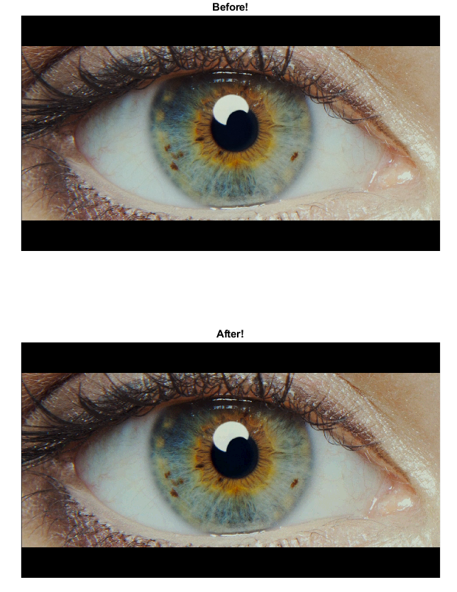
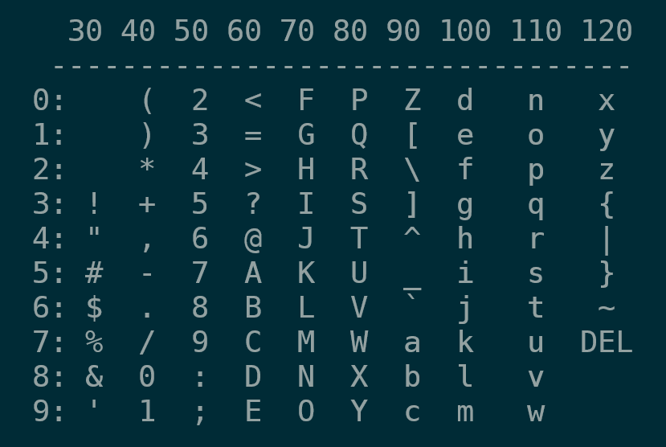
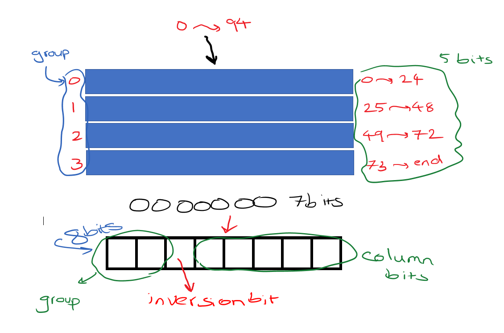

# Image Messenger

If you have a message to someone and you dont want anyone to see that, what you can do is just to hide it in any image and then send it!
This is a real romantic tool to be made!(Needs Engineering Motivation!)

### ***Can you believe that the image below, has the capacity of holding 2.3 Million Characters?***

Can you get the message? Follow along to see how there is a 'the quick brown fox jumps over the lazy dog' popping out of the second image!

## How it Works:
### Encryption has 2 phases:
- String Encryption Phase:
>In OldSchool text saving and processings we have ASCII Code! but  its UNICODE! lets just stick into the Ascii thing...
Every character is represented as a 7 bit number in std IEEE ASCII code... but there is a extended version of that (Ext ASCII) which are 8bitted vals.

> So each char is saved as a 8 bit. but lots of'em are not used in writing which we call'em ControlCharacters! So we only care for {**numbers, alphabet, punctuation, some special characters**}

> As shown above, only characters from 32 into 126 are being used as writing characters. So lets remove that 32 offset and we have numbers starting from 0 into about 94. still 7 bits... 

> ok lets divide them into 4 groups and have a bit to randomly reverse them out!

#### ***so about the inversion bit:*** 
1. if 1 then reverse the column b

### ***and this is the complete structure:***
 

- Image Hiding Phase:
> After having the String in the Encrypted format, we have to put it in the image!

> 8bit Digital Images are Matrices of numbers, where each of'em have 3 values for each pixel to light up in custom RGB brightness!

> 8bit Values? then varying 0~255! Thus in that range having a change in last 3bit won't be considered. And can be used to put the Coded text in it!

### Which was all the Algorithm Design Atittude...
